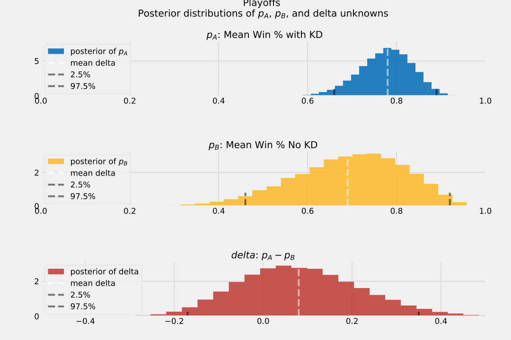

# ab__kd
A Bayesian A/B Test: Are the Warriors better without Kevin Durant? 

In the media, there have been debates about whether or not the Golden State Warriors (GSW) are better without Kevin Durant (KD). From the eye-test, it's laughable to even suggest this, as he's one of the top 3 players in the league (Lebron, KD, Kawhi). Nonetheless, people argue that ball movement is better without him, and therefore make the GSW more lethal.

But, just because the Warriors won a title without KD, that does not mean they don't need him more than ever. At the time of writing, the Toronto Raptors lead 3-1 in the Finals! #WeTheNorth 🦖🍁

Using Bayesian estimation, we can A/B test this hypothesis, by comparing two treatment groups: games played with KD vs. without KD.

Bayesian statistics are an excellent tool to reach for when sample sizes are small, as we can introduce explicit assumptions into the model, when there aren't thousands of observations.

